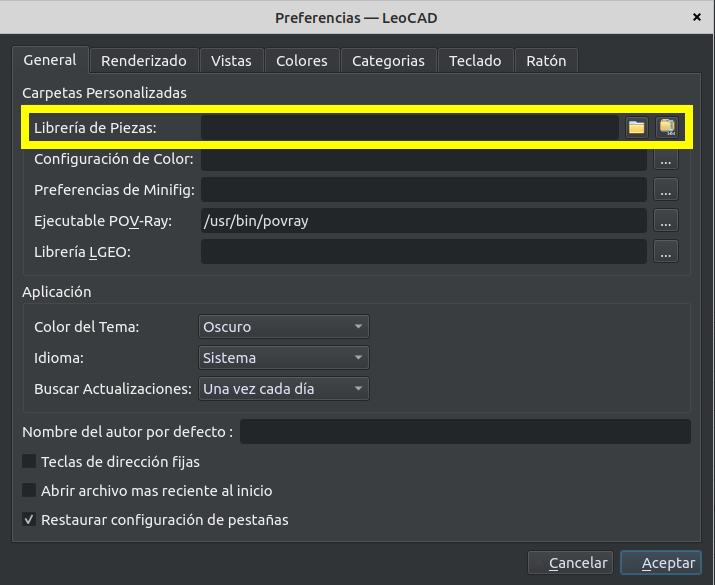
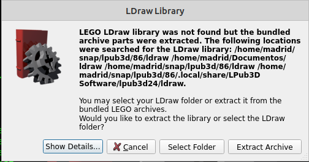
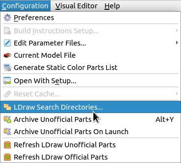
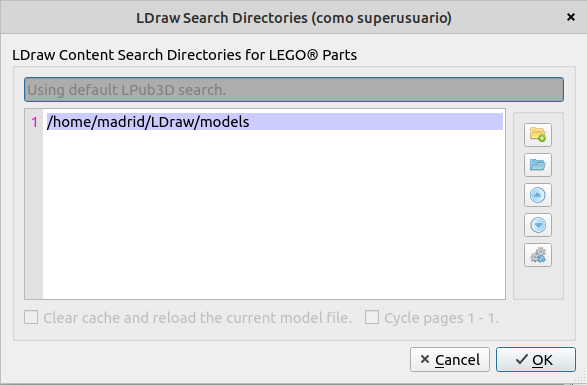

# Instalación de LeoCAD y LPub3D en Ubuntu

## 1. Crear el directorio para la biblioteca LDraw

Antes de instalar LeoCAD, vamos a preparar la biblioteca de piezas en formato digital **LDraw**. LDraw es un formato un estándarde bloques de construcción digitales.

Tendremos una única biblioteca que posteriormente podrán utilizar tanto LeoCAD como LPub3D, y la estructura será algo similar a:


LDraw/

├── parts/

├── p/

├── models/

└── ...


Crearemos la biblioteca dentro de nuestro directorio personal:

#### 1.1. Crear el directorio

Abrimos una terminal y ejecutamos:

```bash
mkdir ~/LDraw
```

#### 1.2. Descargar la biblioteca LDraw mediante Git

Para descargar la biblioteca utilizaremos **Git**.

El proyecto Pybricks-LDraw permite obtener la biblioteca clonando su repositorio.

Nos situamos en nuestro directorio personal:

```bash
cd ~
```

Ahora clonamos el repositorio en el directorio LDraw que hemos creado antes:

```bash
git clone https://github.com/pybricks/ldraw.git LDraw
```

Otra opción es descargar la biblioteca oficial descargada como ZIP desde LDraw.org. Lo importante es tener una única biblioteca LDraw que podamos compartir entre LeoCAD y LPub3D.

## 2. Instalar LeoCAD

Lo siguiente es instalar **LeoCAD utilizando `Flatpak`**, un sistema de distribución de aplicaciones que permite instalar versiones actualizadas de los programas independientemente de los paquetes del sistema de Ubuntu.

### 2.1. Comprobar que Flatpak está instalado

Podemos comprobar que Flatpak está disponible ejecutando:

```bash
flatpak --version
```

Si el comando no está disponible, instalamos Flatpak con:

```bash
sudo apt update
sudo apt install flatpak
```

### 2.2. Añadir Flathub

**Flathub** es el repositorio desde el que instalaremos LeoCAD.

Añadimos Flathub con:

```bash
flatpak remote-add --if-not-exists flathub https://dl.flathub.org/repo/flathub.flatpakrepo
```

### 2.3. Instalar LeoCAD

A continuación, instalamos LeoCAD desde Flathub:

```bash
flatpak install flathub org.leocad.LeoCAD
```

Una vez terminada la instalación, podemos buscar **LeoCAD** en el menú de aplicaciones de Ubuntu.

### 2.3. Ubicación de la librería en LeoCAD
LeoCAD permite especificar la ubicación de la librería mediante el menú ver/preferencias. 

Al acceder a preferencias se abrirá una ventana en la que podemos seleccionar la ruta del directorio LDraw donde hemos guardado la la librería de piezas:



Una vez seleccionada, nos indicará que los cambios se aplicarán la próxima vez que abramos LeoCAD. Cerramos, abrimos y comprobamos el panel de piezas. Deberíamos poder navegar por las diferentes categorías y seleccionar piezas de la librería LDraw.


## 3. Añadir el Third Party Motors Pack de Philo

La biblioteca LDraw que hemos descargado contiene las piezas de la biblioteca que estamos utilizando, pero nuestro proyecto utiliza además motores de terceros.

Para disponer de ellos en LeoCAD, vamos a añadir el **Third Party Motors Pack**, creado por Philippe Hurbain (Philo).

El paquete contiene modelos LDraw de diferentes motores de terceros.

### 3.1. Descargar el paquete

El paquete se puede descargar desde la página de packs de Philo:

[Philo — Parts Packs](https://philohome.com/studio/packs.htm)

En esa página buscamos:

**Third Party motors pack**, que si no ha cambiado estará en este [enlace](https://drive.google.com/file/d/1z4_wFoIKTDgNKI7vWfYE9pcI3qlHtbjX/view)

Descargamos el archivo y lo descomprimiremos.

Desde la consola entramos en el directorio que hemos descomprimido y copiamos los archivos de geekservo a la librería de LDraw. Primero creamos una carpeta específica para estas piezas dentro de la biblioteca de piezas no oficiales de LDraw:

```bash
mkdir -p ~/LDraw/unofficial/CustomParts/parts
```

A continuación copiamos los archivos necesarios para geekservo:

```bash
cp parts/geekservo1*.dat ~/LDraw/unofficial/CustomParts/parts/
```

Al abrir LeoCAD y actualizar la biblioteca de piezas, los bloques de servomotor **geekservo** estarán disponibles en la sección **Electric**.

## 4. Instalar LPub3D

LPub3D también está disponible como aplicación **Flatpak** en Flathub.

### 4.1. Instalar LPub3D

Como ya hemos instalado Flatpak y añadido el repositorio Flathub en el apartado anterior, podemos instalar LPub3D directamente con:

```bash
flatpak install flathub io.github.trevorsandy.LPub3D
```

Durante la instalación, Flatpak puede solicitar confirmación para instalar LPub3D y las dependencias necesarias.

Una vez terminada la instalación, podemos buscar **LPub3D** en el menú de aplicaciones de Ubuntu.

### 4.3. Ubicación de la librería en LPub3D
LPub3D permite también especificar la ubicación de la librería mediante el menú ver/preferencias, pero además, la primera vez que se abre muestra una ventana para seleccionar el directorio directamente.



Aunque probablemente esto no baste para que reconozca las piezas y haga falta cambiar el directorio desde configuración/LDraw Search Directories...



Aparecerá probablemente la ruta ~/LDraw/models



Tendras que añadir el directorio raíz ~/LDraw para que reconozca los bloques de unofficial/CustomParts